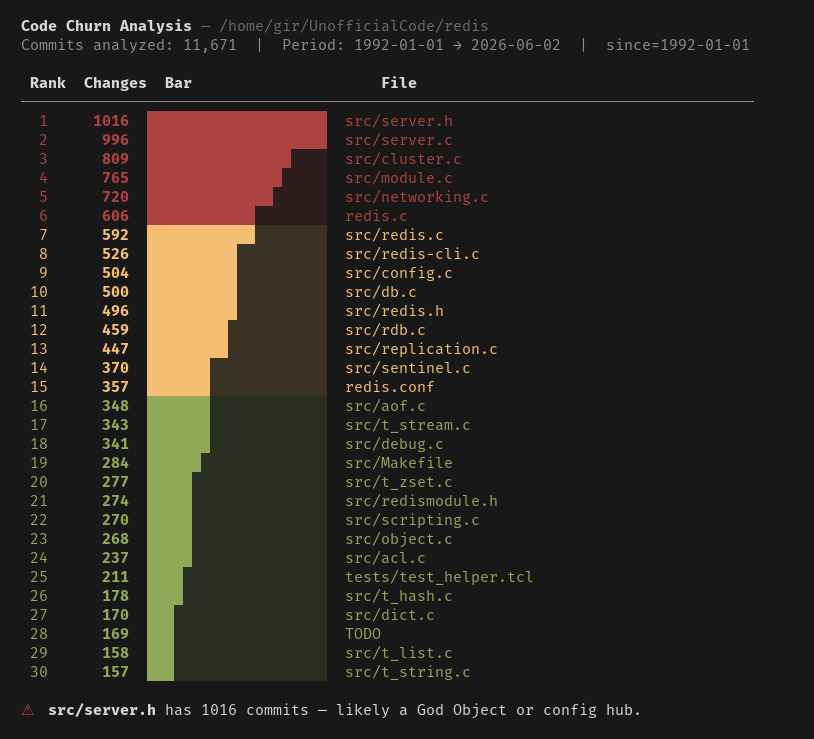

# git-code-churn-cli

A zero-config CLI that reads your git history and shows which files and functions change most often — a reliable proxy for code smells like God Objects, oversized controllers, and poor separation of concerns.



## Install

```bash
npm install -g git-code-churn-cli
```

Or run without installing:

```bash
npx git-code-churn-cli ./my-repo
```

## Usage

```
git-code-churn-cli <repo-path> [options]

Options:
  --top <n>        Show top N files (default: 20, or 5 with --functions)
  --since <date>   Only commits after date      (e.g. 2024-01-01)
  --until <date>   Only commits before date
  --ext <ext>      Filter by extension          (e.g. .js or js)
  --path <prefix>  Filter by path prefix        (e.g. src/)
  --merges         Include merge commits         (excluded by default)
  --functions      Show function-level churn for top JS/MJS/CJS files
  --json           Output raw JSON
  -h, --help       Show this help
```

## Examples

**Basic file churn:**
```bash
git-code-churn-cli ./my-repo
```

**Last 2 years, TypeScript only, top 10:**
```bash
git-code-churn-cli ./my-repo --top 10 --since 2024-01-01 --ext ts
```

**Function-level churn for the top 3 most-churned files:**
```bash
git-code-churn-cli ./my-repo --functions --top 3
```

**Focus on a specific directory:**
```bash
git-code-churn-cli ./my-repo --functions --path src/domain/
```

**JSON output for piping or scripting:**
```bash
git-code-churn-cli ./my-repo --json | jq '.files[0]'
```

## How it works

**File churn:** runs `git log --name-only` once and counts how many times each file appears across commits.

All analysis is **read-only** — the tool never modifies your repository.

## Reading the results

| Color | Meaning |
|-------|---------|
| 🔴 Red | Top 20% by change count — highest churn, most likely to need attention |
| 🟡 Yellow | Middle 30% |
| 🟢 Green | Bottom 50% |

**Smell hints** appear below the table when thresholds are crossed:
- A single file with >100 commits suggests a God Object or a central wiring file that absorbs all changes
- Top 5 files accounting for >40% of all file changes indicates concentrated responsibility
- High function churn (>30 commits) on a single function suggests it should be split

## Requirements

- Node.js ≥ 18
- git in PATH

## License

MIT
